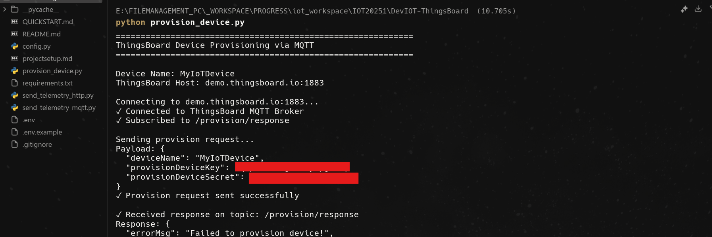
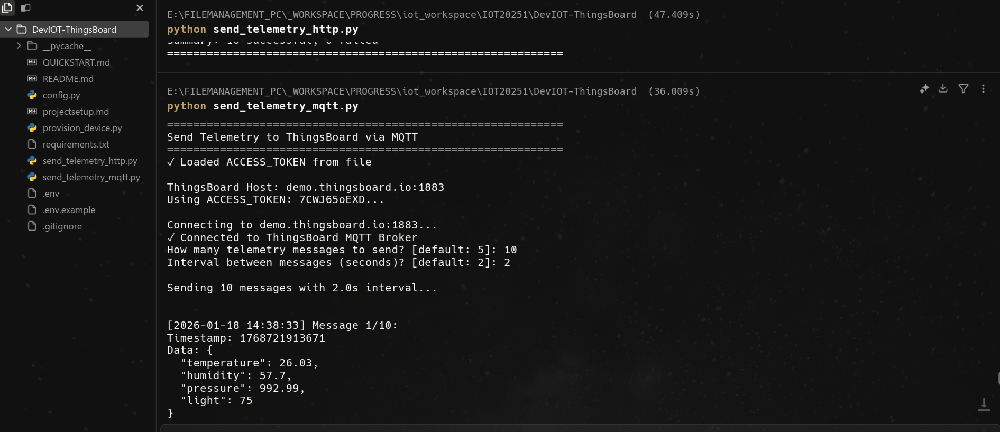
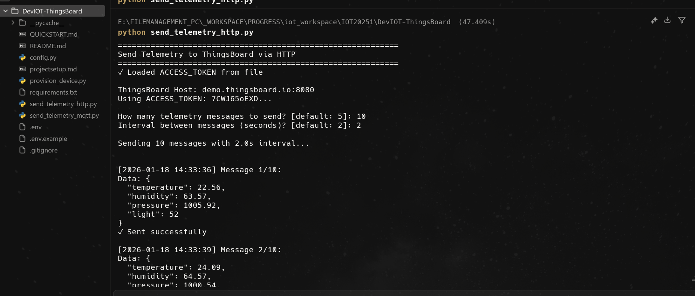
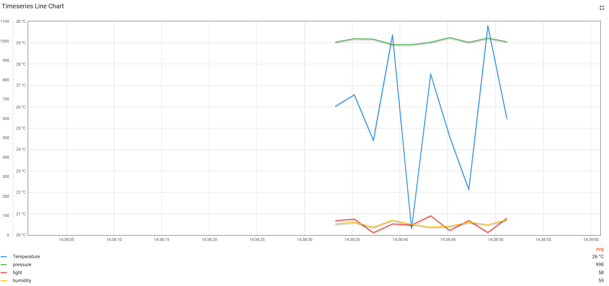
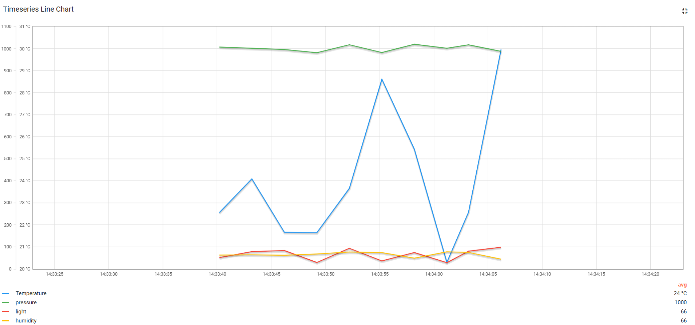

# ThingsBoard IoT Device Simulation

This project simulates an IoT device communicating with ThingsBoard IoT Cloud Platform, implementing device provisioning and telemetry data transmission using both MQTT and HTTP protocols.

## Results

The project successfully demonstrates IoT device communication with ThingsBoard using both MQTT and HTTP protocols. Below are screenshots showing the complete workflow:

### Device Provisioning



Successfully provisioned device "MyIoTDevice" via MQTT. The script connects to ThingsBoard's MQTT broker, sends provisioning credentials, and receives an ACCESS_TOKEN for subsequent telemetry transmission.

### Sending Telemetry via MQTT



Telemetry data transmitted via MQTT protocol showing timestamped sensor readings (temperature, humidity, pressure, light) sent to ThingsBoard at 2-second intervals.

### Sending Telemetry via HTTP



Telemetry data transmitted via HTTP REST API showing timestamped sensor readings successfully posted to ThingsBoard using HTTPS on port 443.

### Data Visualization - MQTT Data



Real-time timeseries chart displaying telemetry data received via MQTT. The chart shows temperature (blue), pressure (green), light (red), and humidity (yellow) values over time, confirming successful data ingestion.

### Data Visualization - HTTP Data



Real-time timeseries chart displaying telemetry data received via HTTP API. The visualization confirms that data sent through HTTP REST API is properly received and visualized in ThingsBoard.

## Project Structure

```
DevIOT-ThingsBoard/
├── config.py                    # Configuration loader
├── provision_device.py          # Device provisioning via MQTT
├── send_telemetry_mqtt.py       # Send telemetry via MQTT
├── send_telemetry_http.py       # Send telemetry via HTTP
├── requirements.txt             # Python dependencies
├── .env.example                 # Environment variables template
├── .env                         # Your environment variables (not tracked by git)
├── access_token.txt             # Generated ACCESS_TOKEN (created after provisioning)
└── README.md                    # This file
```

## Features

### 1. Device Provisioning (MQTT)
- Automatically register a new device with ThingsBoard
- Receive ACCESS_TOKEN for authentication
- Save token for future use

### 2. Send Telemetry via MQTT
- Connect to ThingsBoard using ACCESS_TOKEN
- Send simulated sensor data (temperature, humidity, pressure, light)
- Real-time data transmission

### 3. Send Telemetry via HTTP
- Use HTTP REST API to send telemetry data
- Simple POST requests with ACCESS_TOKEN authentication
- Configurable message frequency

## Setup Instructions

### Prerequisites
- Python 3.7 or higher
- ThingsBoard account (use demo.thingsboard.io or your own instance)
- Device provisioning credentials from ThingsBoard

### Installation

1. Install Python dependencies:
```bash
pip install -r requirements.txt
```

2. Create `.env` file from the template:
```bash
cp .env.example .env
```

3. Edit `.env` with your actual ThingsBoard credentials:
```bash
THINGSBOARD_HOST=demo.thingsboard.io
PROVISION_DEVICE_KEY=your_provision_key
PROVISION_DEVICE_SECRET=your_provision_secret
DEVICE_NAME=MyIoTDevice
```

**Note:** Never commit `.env` to version control (it's in `.gitignore`).

### Getting Provisioning Credentials

1. Log in to ThingsBoard
2. Go to **Device profiles** → Select your profile → **Device provisioning**
3. Enable provisioning and note the:
   - Provision device key
   - Provision device secret

## Usage

### Step 1: Provision Device

Run the provisioning script to register your device:

```bash
python provision_device.py
```

This will:
- Connect to ThingsBoard MQTT broker
- Send provisioning request
- Receive and save ACCESS_TOKEN to `access_token.txt`

### Step 2: Send Telemetry via MQTT

```bash
python send_telemetry_mqtt.py
```

You'll be prompted for:
- Number of messages to send
- Interval between messages

The script will send simulated sensor data to ThingsBoard.

### Step 3: Send Telemetry via HTTP

```bash
python send_telemetry_http.py
```

Similar to MQTT, but uses HTTP POST requests instead.

## Telemetry Data Format

The programs send simulated sensor data:

```json
{
  "temperature": 25.34,
  "humidity": 65.21,
  "pressure": 1013.45,
  "light": 75
}
```

## Verification

After running the programs:

1. Log in to ThingsBoard
2. Navigate to **Devices**
3. Find your device (e.g., "MyIoTDevice")
4. Check **Latest telemetry** to see received data
5. View data on dashboards or create visualizations

## Troubleshooting

### Connection Issues
- Verify `THINGSBOARD_HOST` in `.env` file
- Check firewall settings for ports 1883 (MQTT) and 443 (HTTPS)
- Ensure internet connectivity

### Provisioning Fails
- Verify provisioning credentials are correct
- Check that device provisioning is enabled in ThingsBoard
- Ensure device name doesn't already exist

### No Data Received
- Verify ACCESS_TOKEN is correct
- Check ThingsBoard device status
- Review ThingsBoard logs for errors

## Dependencies

- `paho-mqtt`: MQTT client library
- `requests`: HTTP client library

## License

This project is for educational purposes as part of IoT coursework.

## Author

Created for IoT Programming Course - Assignment 9
